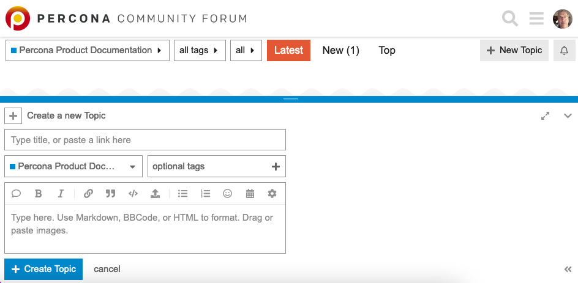

# Documentation Contributing Guide

We welcome contributions from all users and the community. By contributing, you agree to the [Percona Community code of conduct](https://percona.community/contribute/coc/). Thank you for deciding to contribute and help us improve the [ProxySQL Admin documentation](https://docs.percona.com/proxysql-admin/).

You can contribute to the documentation in the following ways:

## Rate and comment on documentation pages

Each documentation page includes a **Rate this page** feature at the bottom that allows you to assign stars (1-5) and leave comments. This is a quick and easy way to provide feedback about the documentation.

To rate a page:

1. Scroll to the bottom of any documentation page.

2. Use the star rating system to rate the page (1-5 stars).

3. Leave a comment describing your feedback.

!!! important "Please leave detailed comments"

    If you want the documentation team to fix or improve something, **please leave detailed comments** explaining:
    
    * What issue you encountered or what improvement you'd like to see
    * Which section or topic needs clarification or correction
    * Any specific examples or use cases that would help
    * The version or environment you're using (if relevant)
    * Steps to reproduce any issues you found
    
    **Detailed comments are essential** - they help us understand your needs and make the documentation better for everyone. Brief comments like "this is confusing" or "needs improvement" are helpful, but specific details about what's confusing or what needs improvement allow us to take action.

## Add a topic in the Percona Community Forum

The [Percona Community Forum](https://forums.percona.com/) is a public discussion platform where you can ask questions, share feedback, or suggest improvements to the documentation. Use the forum to start a conversation about documentation issues, request clarifications, or discuss potential changes with the community and documentation team.

To add a topic, navigate to the [Percona Product Documentation category](https://forums.percona.com/c/percona-product-documentation/71) in the Percona Community Forum and select **New Topic**. Complete the form and select **Create Topic** to add the topic to the forum.



## Request a change with a Jira issue

Create a Jira ticket to report documentation issues or request changes. This method is useful for formal tracking or when you want the documentation team to handle the changes.

1. Open the [ProxySQL Admin Jira project](https://jira.percona.com/projects/PSQLADM/issues) in your browser.

2. Sign in (or create a Percona Jira account if you don't have one).

3. Click the **Create** button.

4. Fill in the required fields:

    * **Summary**: Provide a brief description of the issue.

    * **Description**: Provide more information about the issue. If needed, add a Steps To Reproduce section and information about your environment (version number, your operating system, etc.). Be detailed.

    * **Version**, **Environment**, and other relevant fields as needed.

5. Click **Create** to submit the ticket.

!!! tip "Shortcut to the issue creation screen"

    To go directly to the Create Issue form, use this URL: [https://jira.percona.com/secure/CreateIssue!default.jspa?pid=10100](https://jira.percona.com/secure/CreateIssue!default.jspa?pid=10100)

## Edit the documentation yourself

Use the [Edit documentation online with GitHub](#edit-documentation-online-with-github) method or the [Edit documentation locally](#edit-documentation-locally) method to make changes to the documentation and create a pull request. 

### What you should know

The documentation is primarily in plain text, but you may use [Markdown](https://www.markdownguide.org/) to add syntax elements (notes, tables, and so on) to the documentation. 

### What happens after you create the pull request

Our team reviews your pull request and provides feedback or approval. Once approved, we merge your changes into the appropriate branch. Thank you for taking the time to improve our documentation!

!!! note

    We appreciate your work, but the PR may be revised to meet internal requirements.

### Edit documentation online with GitHub

1. At the top of the documentation page, select **Edit this page on GitHub** (or the pencil icon) to open the source file in the GitHub editor. If you haven't worked with the repository before, GitHub creates a [fork](https://docs.github.com/en/github/getting-started-with-github/fork-a-repo) automatically.

2. Edit the page using the [Markdown](https://www.markdownguide.org/) syntax.

3. Review your changes by clicking the **Preview** tab to see how they will appear.

4. Scroll to the bottom of the page to the **Commit changes** section.

5. Add a commit message (72 characters or less) describing what you changed.
 
6. Select the **Create a new branch for this commit and start a pull request** option. GitHub will suggest a branch name, which you can accept or modify.

7. Click **Commit changes**.

8. GitHub creates a branch and commit for your changes, then displays a page where you can create a pull request. This page shows:

   * The base branch where you're proposing your changes

   * Your commit message

   * A visual diff of your changes

9. Review the information and click **Create pull request**.

For more information, see [Editing files in GitHub](https://docs.github.com/en/repositories/working-with-files/managing-files/editing-files).

### Edit documentation using GitHub CLI

This option uses the [GitHub CLI (`gh`)](https://cli.github.com/) tool, which provides a command-line interface for GitHub operations.

!!! note "Prerequisites"
    
    You need GitHub CLI installed on your system. If you don't have it installed, see the [GitHub CLI installation guide](https://cli.github.com/manual/installation).

1. Authenticate with GitHub:

    ```shell
        gh auth login
    ```

2. Fork the repository (if you haven't already):

    ```shell
        gh repo fork percona/proxysql-admin-tool-doc
    ```

3. Clone your forked repository:

    ```shell
        gh repo clone <your_github_name>/proxysql-admin-tool-doc
        cd proxysql-admin-tool-doc
    ```

4. Create a new branch for your changes:

    ```shell
        git checkout -b <my_changes>
    ```

5. Edit the files in the `/docs` directory using your preferred editor.

6. Stage and commit your changes:

    ```shell
        git add docs/example.md
        git commit -m 'Fixed typo in documentation'
    ```

7. Push your branch to your fork:

    ```shell
        git push -u origin <my_changes>
    ```

8. Create a pull request using GitHub CLI:

    ```shell
        gh pr create --title "Your PR title" --body "Description of your changes"
    ```

    Alternatively, you can use the interactive mode:

    ```shell
        gh pr create
    ```

For more information, see [GitHub CLI documentation](https://cli.github.com/manual/).

### Edit documentation locally

This option is for users who are comfortable with [git](https://git-scm.com/) commands.

1. Fork this repository on GitHub.

2. Clone your forked repository to your machine:

    ```shell
        git clone https://github.com/<your_github_name>/proxysql-admin-tool-doc.git
        cd proxysql-admin-tool-doc
    ```

    !!! note "SSH alternative"
    
        If you have SSH keys set up with GitHub, you can use `git@github.com:<your_github_name>/proxysql-admin-tool-doc.git` instead.

3. Add the upstream remote to track the original repository:

    ```shell
        git remote add upstream https://github.com/percona/proxysql-admin-tool-doc.git
    ```

4. Checkout the appropriate branch for the version you're working on (for example, `main` for the latest documentation) and pull the latest changes from upstream:

    ```shell
        git checkout main
        git pull upstream main
    ```

    !!! note "Which branch to use"
    
        Use the branch that matches the version of the documentation you're editing. Typically, use the `main` branch for the latest ProxySQL Admin documentation. If the branch doesn't exist locally, Git will create a tracking branch automatically.

5. Create a separate branch for your changes:

    ```shell
        git checkout -b <my_changes>
    ```

6. Edit the files in the `/docs` directory. Add code examples, if necessary. We recommend that you check your changes using a Preview built into your editor (if you have one).

7. Add the changed file (replace `docs/example.md` with your actual file path):

    ```shell
        git add docs/example.md
    ```

8. Commit your changes (replace the message with a description of your changes):

    ```shell
        git commit -m 'Fixed typo in documentation'
    ```

9. Push your branch to your fork:

    ```shell
        git push -u origin <my_changes>
    ```

10. On GitHub, you'll see a notification banner with a **Compare & pull request** button. Click it to open a pull request to the Percona repository. Alternatively, navigate to your fork and click **Create pull request**.
